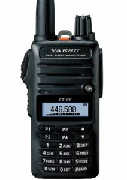

## Yaesu FT-65E
 

### Radio settings
#### Transmit power
* 0.5 W (Low)
* 2.5 W (Middle)
* 5.0 W (High)

#### Receiver sensitivity
* 0.2 μV (-121dBm) for 12 dB [SINAD](https://en.wikipedia.org/wiki/SINAD) (420 - 470 MHz, NFM)

#### PMR446
European version of the FT-65 can listen to PMR446, but is not allowed to transmit on that band.  Transmission on PMR446 is only allowed with PMR446-certified radios (fixed antenna, TX-power limited to 0.5W, ...), which the FT-65E is clearly not.

It's however technically possible to use a Yaesu FT-65E on PMR446:

1. Expand TX-range of a Yaesu FT-65E outside the ham-bands using this guide [here](https://simonthewizard.com/2017/12/17/yaesu-ft-65-expand/).
2. Set the following menu options in the FT-65E:
    32 : TX Power : LOW (which is 0.5W)
    37 : WIDE/NAR : NARROW (+/-2.5kHz deviation), when set to wide the Midland cuts off reception above 800Hz.
3. Set the TX-frequency equal to that of a PMR446-radio.
4. Frequency step : 30 : Step : 6.25kHz
5. Squelch type:
  1. CTCSS:
     * 8 : CTCSS : set up the same as a PMR446-radio.  On Kenwood PMR446 handsets, this will be called "Quiet Talk (QT)" setting, but it's essentially the same thing.
     * 29 : SQL Type : TSQL
  2. DCS:
     * 11 : DCS-code : e.g. RX : 754, TX : 754
     * 29 : SQL Type : DCS
     
### Antenna
During the tests:
* Set the TX power level (32:TX PWR) to LOW (0.5W)
* Replace the antenna by an RP-SMA to SMA adapter and add a 50Ω terminator.

    
### Audio IO
Don't turn the volume knob more than 50% to avoid distortion.  
Maximum undistorted audio output is 4.65Vpp, 1.85Voffset at 1kHz.

Maximum analog input voltage peak-peak for the Yaesu FT-65E = **30mVpp**

#### TX-Delay
This is the delay needed between pushing the PTT-button and the FT-65E being ready to transmit.  The delay is measured using a 1kHz sine wave signal.

* From Yaesu PTT-down to Midland G9 Pro opening its squelch = <144ms.
* From Yaesu PTT-down to Midland G9 Pro which has squelch-open all the time = <110ms.  Most of the times, it's between 80ms and 100ms.

#### TX-Tail
This is the delay needed between releasing the PTT-button and the FT-65E stopping to transmit.  The delay is measured using a 1kHz sine wave signal.

* From Yaesu PTT-up to Midland G9 Pro (squeltch-open all the time) = <170ms.  Most of the times, it's between 120ms and 140ms.

#### Audio connectors
Motorola M1 connector : 7.62mm spacing between TRS-jacks.
* The threaded insert has an unknown screw thread.  It's close to M2.5, but not exactly the same.
* 3.5mm : 
  * Tip = speaker- (Vcm = 2.5V)
    * Jumps to 2V when squelch is open.  Audio max = 4V (with respect to GND)
  * Ring = ?
    * internal 10K PU to 3V3, unknown purpose
    * Short circuited to sleeve when using the SSM-17B Hand speaker Mic. Maybe that's the reason why Yaesu doesn't market the SSM-17B as an accessory to the FT-65.  The SSM-512B is advised instead.
  * Sleeve = speaker+ (Vcm = 2.5V)
* 2.5mm : 
  * Tip = Connect a PTT switch in series with electret-MIC (1K8 or 2K2 internal resistance) connected to GND.  Function generator outputs must be AC-coupled to this input, otherwise the PTT functionality no longer works correctly.
  * Ring = RX/TX line
    * RX/TX Short circuited to sleeve when using the SSM-17B Hand speaker Mic.
    * Use open drain TX and connect it to RX.  
    * To interface to a standard UART: connect the anode of a diode to the UART-RX. Connect the cathode of that same diode to the UART-TX. 
  * Sleeve = GND
    
### References
* [Packet radio projects (including APRS)](https://sites.google.com/site/rio4br/Home/aprs)
* [Ham.stackexchange.com](https://ham.stackexchange.com/questions/11776/what-is-the-external-mic-speaker-pinout-for-the-yaesu-ft-4xr-ft-65r-ft-25r)
* [Autocom intercom integration](http://largiader.com/electric/autocom.html)
* [BOMMEOW PARENT-BCT35-M1 3-Wire Acoustic Clear Tube Earpiece for Motorola Mototrbo CLS1410 XT460 DLR1020 Bearcom](https://www.bommeow.com/products/bommeow-parent-bct35-m1-3-wire-acoustic-clear-tube-earpiece-for-motorola-mototrbo-cls1410-xt460-dlr1020-bearcom)