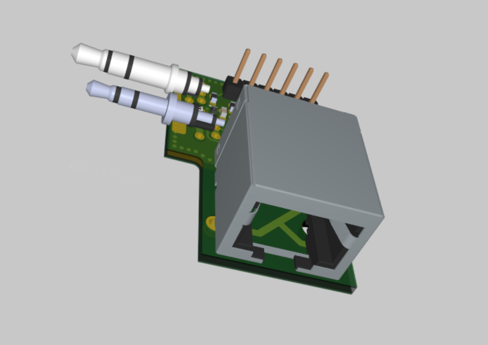
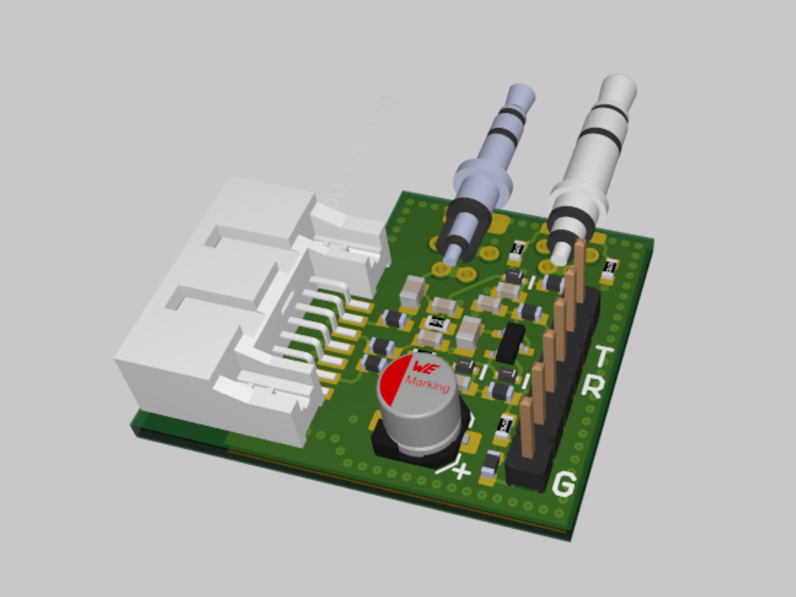

# OHIS-interface

According to [the OHIS-reference document](https://open-headset-interconnect-standard.github.io/ohis/Open-Headset-Interconnect-Standard.pdf):
> With the Open Headset Interconnect Standard, or OHIS, the club/EOC can build/buy one adapter for every
radio which stays with that radio, and the user only needs to build/buy one adapter for their specific headset
which stays with their headset, and now they can achieve full interoperability with only O(N) adapters.

# Criticism to OHIS
* Too many rigs are already using 8C/8p-modular jack connectors, but with a different pinout.  There's a big chance of breaking the radio if you plug in the wrong headset.
* The hook on the modular jack easily breaks if you don't protect it.
* One ground wire for mic and a separate ground wire for everything else would be enough instead of all the ground wires in the OHIS standard.
* When compared to a 3.5mm TRRS jack and cable, the modular jack is quite a bulky connector.

# Alternative interfaces
## CAIRO
* [CAIRO](https://web.archive.org/web/20060618023257/http://www-users.aston.ac.uk/~bestpj/cairo/manual/engineering.html#ce1) : based on DIN-connectors, which are quite big as well.  They are however relatively common, cheap and easy to find.

## SATA-interface

The SATA-interface is a low profile alternative to the modular jack.  It's easy to find cheap cables and connectors for it.  The SATA-connector has a locking mechanism, which is a big advantage over the TRS-jack.

Just to make it clear : this is not a SATA-interface, so you can't connect it to your hard drive.  We use the SATA-connector, but don't follow the SATA standard.  Confusion is very unlikely because the use case here is very different from the normal use case inside a computer.

The SATA connector has two differential pairs and three ground wires.  The differential pairs are used for the speaker, microphone, PTT and power.  The ground wires are used as current return path.  

| Pin | Signal | Description |
| --- | ------ | ----------- |
| 1 | GND | Ground |
| 2 | SPK | Speaker |
| 3 | VCC | Power, max 5V, 200mA |
| 4 | GND | Ground |
| 5 | PTT | Push-To-Talk |
| 6 | MIC | Microphone |
| 7 | GND | Ground |

# Interface boards
This repostiory contains interface boards for the OHIS and SATA interfaces.  The interface boards are designed in Altium.

## Yaesu FT-65E
The OHIS- and SATA-interface to the FT-65E are also providing a pin header for UART interface to the radio.  This allows you to program the radio using a USB-UART converter and [CHIRP](https://chirpmyradio.com/projects/chirp/wiki/Home).  

* [Radio technical doc](./Devices/Yaesu_FT-65/Yaesu_FT65-E.ipynb)
* [OHIS FT-65E interface, version 1.0.0 (Altium online viewer)](https://365.altium.com/files/52D7B6AC-E25B-4030-AC4F-B64CA4D52889)
* [SATA FT-65E interface, version 1.0.0 (Altium online viewer)](https://365.altium.com/files/A41D46D5-1541-4C2A-84D1-905C59505208)

## Midland G9 Pro
* [Radio technical doc](./Devices/Midland_G9_Pro/MidlandG9pro.md)

These interfaces might work on more radios, but they have only been tested on the radios listed above.